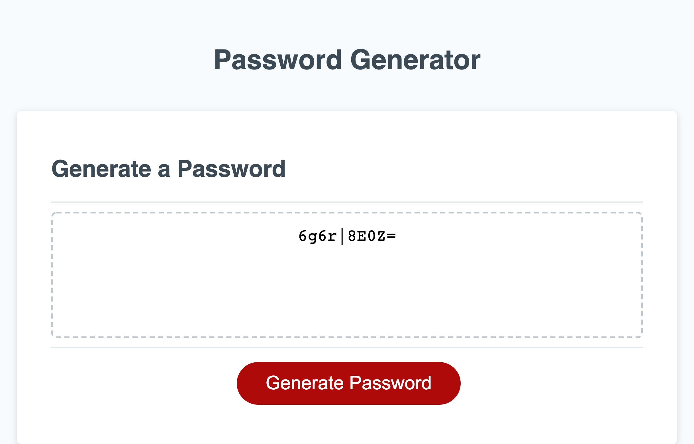
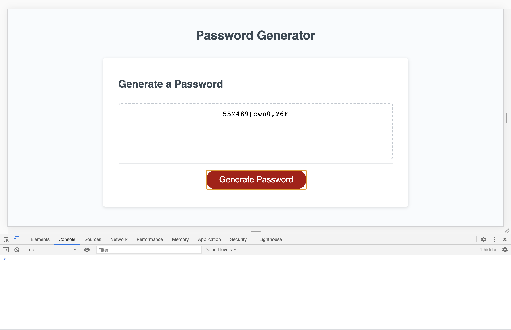

## 
# Employee-Password-Generator

## Hello

My name is **Bryson Palmer** and I am a student Jr web developer. I'm currently a bootcamp *full stack* web developer student through the *University of Washington* under *Trilogy Education Services*. I'm looking to get into web development for my professional work. I plan on being a capable, creative, team oriented developer by the end of this program. I look forward to implementing this new skill in future employment. 

## My Task

Was to create an application that an employee could use to generate a random password based on criteria they’ve selected by modifying starter code. This app will run in the browser, and will feature dynamically updated HTML and CSS powered by JavaScript code that I wrote. It will have a clean and polished user interface that is responsive, ensuring that it adapts to multiple screen sizes.

## User Story

As an employee with access to sensitive data,  
I want to randomly generate a password that meets certain criteria  
SO that I can create a strong password that provides greater security.

## Page Navigation Links

[Acceptance Criteria](#acceptance-criteria)  
[Links to Git Hub and Live url](#links)  
[Full Screenshot](#screenshot-of-full-screen)  
[iPhone Screenshot](#screenshot-of-iphone)  
[Console Screenshot](#screenshot-of-console)  
[Future Tickets](#future-tickets)  
[Other Information](#other-information)  

##  💼 Acceptance Criteria

GIVEN I need a new, secure password 
* WHEN I click the button to generate a password  
THEN I am presented with a series of prompts for password criteria
* WHEN prompted for password criteria  
THEN I select which criteria to include in the password
* WHEN prompted for the length of the password  
THEN I choose a length of at least 8 characters and no more than 128 characters
* WHEN prompted for character types to include in the password  
THEN I choose lowercase, uppercase, numeric, and/or special characters
* WHEN I answer each prompt  
THEN my input should be validated and at least one of the character types should be selected * 
* WHEN all prompts are answered  
THEN a password is generated that matches the selected criteria
* WHEN the password is generated  
THEN the password is either displayed in an alert or written to the page

- [✔️] **Status Complete**

*Note: I populated my numbers array with 5 times the values ( 5 * [0, 1, 2, 3, 4, 5, 6, 7, 8, 9] ) so that the quantity of numbers would be relative in size to the other criteria. There is no gaurantee that you will get an even amount of user selected criteria but each criteria is relative in size to each other and therefore has a relative equal chance of being selected. In a future ticket this could be addressed. 
__________________________

##  Links

Link to **repository** on **Git Hub** - [https://github.com/Bryson-Palmer/Employee-Password-Generator.git](https://github.com/Bryson-Palmer/Employee-Password-Generator.git)

Live **URL** link to the **Employee Password Generator** - [https://bryson-palmer.github.io/Employee-Password-Generator/](https://bryson-palmer.github.io/Employee-Password-Generator/)
 
__________________________

## 📸  Screenshot of full screen

.png)

## 📸  Screenshot of iPhone X

 

## 📸  Screenshot of console

 

##  🔍 Future Tickets

* Have the previous password cleared before a new user generates a new password.
* Guarantee an equal amount of each type of criteria character.
* Create methods for the object instead of repeating actions in the javascript. For example, the confirm and assign tasks are repeated actions. 

##  📡 Other Information

* Installation: none
* Usage: A secure password generator for employees who have access to sensitive data.
* Credits: I would like to credit my teacher, TAs, and peers for their help and support. Also, W3Schools and Web MD for their well organized information regarding objects, arrays[], push(), concat(), prompt, confirm, alert, and parseInt topics.
* License: No license at this time.

[Back to Top](#back-to-top)  